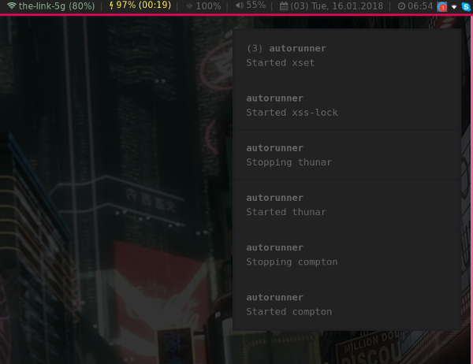

# autorunner

**[TL;DR](#tldr)** |
**[Installation](#installation)** |
**[Configuration file](#configuration-file)** |
**[Log files](#log-files)** |
**[Requirements](#requirements)** |
**[Screenshots](#screenshots)** |
**[License](#license)**

[](https://travis-ci.org/cytopia/autorunner)


`autorunner` is an autostart helper for your required desktop services and tools on a leight-weight wm without any integrated autostart manager. Commands can be started or restarted when already running. It offers desktop notifications on events (start and stop) as well as separated logs for `stdout` and `stderr` for each of the started service.

By having log files available for commands that usually don't log, you can always check if everything runs as expected or if problems might be present.

## TL;DR

### 1. Set up services

**`$XDG_CONFIG_HOME/autorunner/config:`**
```bash
# Autorunner configuration file
#
# Usage: execute "<restart>" "<notify>" "<command>"
#
#   <restart>    1: Kill the process and restart it
#                0: Only start when it is not running
#
#   <notify>     1: Notify via notifications when started/restarted
#                0: Do not notify
#   <command>    Full command (including arguments) to run

# Start clipmenud when it is not running (never restart it) and notify
execute "0" "1" "clipmenud"

# Run thunar --daemon, always restart it and notify
execute "1" "1" "thunar --daemon"
```

### 2. Hook autorunner into any startup

**Example for i3-wm**

Put the following line into your i3 config (`$XDG_CONFIG_HOME/i3/config`):
```
exec_always --no-startup-id sh path/to/autorunner
```

**Example to manually start it:**

You can always run it manually as often as you want:
```bash
$ /path/to/autorunner
```

## Installation

Just copy `autorunner` to a location in `$PATH`.


## Configuration file
**`$XDG_CONFIG_HOME/autorunner/config`**

Configuration to `autorunner` is in an [xdg-compliant path](https://specifications.freedesktop.org/basedir-spec/basedir-spec-latest.html) which is: `$XDG_CONFIG_HOME/autorunner/config`. `XDG_CONFIG_HOME` is usually `$HOME/.config/` if not otherwise overwritten by the user. If no configuration file exists an empty one will be created in that path.

Command or services to start up are configured in the following form:
```bash
execute "<restart>" "<notify>" "<command>"
```

#### `<restart>`
* Can take a value of `0` or `1`
* `0`: Only start when it is not running, but never restart it
* `1`: If it is running, stop it and then start it again. If it is not running, start it

#### `<notify>`
* Can take a value of `0` or `1`
* `0`: Do not send any notifications
* `1`: Send notifications to the running notification service about stop and start events (requires `notify-send`)

#### `<command>`
This can be an absolute or relative path including arguments of any command. Commands can be foreground or background daemons as well as one-shots such as setting your wallpaper via `feh`

#### Examples
```bash
execute "0" "1" "dunst"

execute "0" "1" "nm-applet"

execute "1" "1" "thunar --daemon"

execute "0" "1" "xss-lock -v -n \"notify-send --urgency=critical --icon=/usr/share/icons/Adwaita/48x48/actions/system-lock-screen.png -- 'Auto-lock in 30 sec.'\" -- /usr/local/bin/xlock"
```


## Log files
**`$XDG_DATA_HOME/autorunner/log/`**

Log files are in an [xdg-compliant path](https://specifications.freedesktop.org/basedir-spec/basedir-spec-latest.html) which is: `$XDG_DATA_HOME/autorunner/log/`. `XDG_DATA_HOME` is usually `$HOME/.local/share/` if not otherwise overwritten by the user.

There are three different types of logs:

| Log file | Description |
|----------|-------------|
| `autorunner.log` | `autorunner`s own log file keeping track of all events
| `<command>.out`  | `stdout` of the started command |
| `<command>.err`  | `stderr` of the started command |

### Examples

#### log directory
```bash
$ ls -l
-rw-r--r-- 1 cytopia 39496 Jan 16 06:42 autorunner.log
-rw-r--r-- 1 cytopia   659 Jan 16 06:49 compton.err
-rw-r--r-- 1 cytopia 12288 Jan 15 11:31 compton.out
-rw-r--r-- 1 cytopia  1906 Jan 16 05:39 thunar_--daemon.err
-rw-r--r-- 1 cytopia     0 Jan 15 08:03 thunar_--daemon.out
-rw-r--r-- 1 cytopia     0 Jan 15 08:03 xset_b_off.err
-rw-r--r-- 1 cytopia     0 Jan 15 08:03 xset_b_off.out
-rw-r--r-- 1 cytopia     0 Jan 15 08:03 xset_dpms_0_0_300.err
-rw-r--r-- 1 cytopia     0 Jan 15 08:03 xset_dpms_0_0_300.out
-rw-r--r-- 1 cytopia     0 Jan 15 08:03 xset_r_rate_250_40.err
-rw-r--r-- 1 cytopia     0 Jan 15 08:03 xset_r_rate_250_40.out
-rw-r--r-- 1 cytopia     0 Jan 15 08:03 xset_s_600_30.err
-rw-r--r-- 1 cytopia     0 Jan 15 08:03 xset_s_600_30.out
-rw-r--r-- 1 cytopia  1178 Jan 16 06:42 xss-lock_-v_-n_notif.err
-rw-r--r-- 1 cytopia     0 Jan 15 08:03 xss-lock_-v_-n_notif.out
```

#### autorunner.log
```
[2018-01-15  14:46:21] [INFO]:    ==================== autorunner triggered ====================
[2018-01-15  14:46:21] [INFO]:    (clipmenud) already running with pid: '11192'
[2018-01-15  14:46:21] [INFO]:    (xset) started with pid '23325'
[2018-01-15  14:46:21] [INFO]:    (xss-lock) started with pid '23356'
[2018-01-15  14:46:21] [INFO]:    (nm-applet) already running with pid: '7270'
[2018-01-15  14:46:21] [INFO]:    (thunar) restart required
[2018-01-15  14:46:21] [INFO]:    (thunar) trying to kill
[2018-01-15  14:46:21] [INFO]:    (thunar) running with pid '16303'
[2018-01-15  14:46:21] [INFO]:    (thunar) killed pid: '16303'
[2018-01-15  14:46:21] [INFO]:    (thunar) started with pid '23438'
[2018-01-15  14:46:21] [INFO]:    (compton) restart required
[2018-01-15  14:46:21] [INFO]:    (compton) trying to kill
[2018-01-15  14:46:21] [INFO]:    (compton) running with pid '16357'
[2018-01-15  14:46:21] [INFO]:    (compton) killed pid: '16357'
[2018-01-15  14:46:21] [INFO]:    (compton) started with pid '23493'
[2018-01-15  14:46:21] [INFO]:    (dunst) already running with pid: '28225'
```
#### compton.err
```
glx_bind_pixmap(0x02a1405f): Failed to query Pixmap info.
win_paint_win(0x01600001): Failed to bind texture. Expect troubles.
win_paint_win(0x01600001): Missing painting data. This is a bad sign.
```

## Requirements

* `bash` (required)
* `pgrep` (required)
* `notify-send` (optional)


## Screenshots

Showing autorunner notifications via dunst on i3

[](screenshot.png)


## License

[MIT License](LICENSE.md)

Copyright (c) 2017 [cytopia](https://github.com/cytopia)
