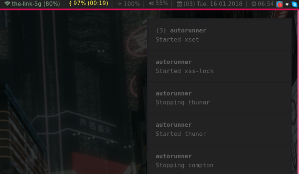

# autorunner

**[Install](#tada-install)** |
**[Uninstall](#no_entry_sign-uninstall)** |
**[Features](#star-features)** |
**[TL;DR](#coffee-tldr)** |
**[Configure](#wrench-configure)** |
**[Logging](#open_file_folder-logging)** |
**[Requirements](#exclamation-requirements)** |
**[Linux Tools](#octocat-cytopia-linux-tools)** |
**[License](#page_facing_up-license)**

[](https://github.com/cytopia/autorunner/actions?workflow=Linting)
[](https://github.com/cytopia/autorunner/actions?workflow=Testing)
[](https://github.com/cytopia/autorunner/releases)
[](https://github.com/void-linux/void-packages/tree/master/srcpkgs/autorunner)
[](https://opensource.org/licenses/MIT)

`autorunner` is a resource-mild autostart helper for all your required desktop services and tools, intended to be used on a very light-weight window manager.

Commands can be started and/or restarted (when already running), while offering desktop notifications on these event as well as separated logs for `stdout` and `stderr` on each of your configured tools.
By having log files available for commands that usually don't log, you can always check if everything runs as expected or if problems might be present.

[](doc/screenshot.png)


## :tada: Install
```bash
sudo make install
```


## :no_entry_sign: Uninstall
```bash
sudo make uninstall
```


## :star: Features

* Suckless and leight-weight autostart manager
* Desktop notifications
* Full customization
* Logging


## :coffee: TL;DR

### 1. Set up services

**`$XDG_CONFIG_HOME/autorunner/config:`**
```bash
# Autorunner configuration file
#
# Usage: execute "<restart>" "<notify>" "<command>"
#
#   <restart>    1: Kill the process and restart it
#                0: Only start when it is not running
#
#   <notify>     1: Notify via notifications when started/restarted
#                0: Do not notify
#   <command>    Full command (including arguments) to run

# Start clipmenud when it is not running (never restart it) and notify
execute "0" "1" "clipmenud"

# Run thunar --daemon, always restart it and notify
execute "1" "1" "thunar --daemon"
```

### 2. Hook autorunner into any startup

**Example for i3-wm**

Put the following line into your i3 config (`$XDG_CONFIG_HOME/i3/config`):
```
exec_always --no-startup-id sh /usr/local/bin/autorunner
```

**Example to manually start it:**

You can always run it manually as often as you want:
```bash
$ /usr/local/bin/autorunner
```


## :wrench: Configure

**`$XDG_CONFIG_HOME/autorunner/config`**

Configuration to `autorunner` is in an [xdg-compliant path](https://specifications.freedesktop.org/basedir-spec/basedir-spec-latest.html) which is: `$XDG_CONFIG_HOME/autorunner/config`. `XDG_CONFIG_HOME` is usually `$HOME/.config/` if not otherwise overwritten by the user. If no configuration file exists an empty one will be created in that path.

Command or services to start up are configured in the following form:
```bash
execute "<restart>" "<notify>" "<command>"
```

#### `<restart>`
* Can take a value of `0` or `1`
* `0`: Only start when it is not running, but never restart it
* `1`: If it is running, stop it and then start it again. If it is not running, start it

#### `<notify>`
* Can take a value of `0` or `1`
* `0`: Do not send any notifications
* `1`: Send notifications to the running notification service about stop and start events (requires `notify-send`)

#### `<command>`
This can be an absolute or relative path including arguments of any command. Commands can be foreground or background daemons as well as one-shots such as setting your wallpaper via `feh`

#### Examples
```bash
execute "0" "1" "dunst"

execute "0" "1" "nm-applet"

execute "1" "1" "thunar --daemon"

execute "0" "1" "xss-lock -v -n \"notify-send --urgency=critical --icon=/usr/share/icons/Adwaita/48x48/actions/system-lock-screen.png -- 'Auto-lock in 30 sec.'\" -- /usr/local/bin/xlock"
```


## :open_file_folder: Logging

**`$XDG_DATA_HOME/autorunner/log/`**

Log files are in an [xdg-compliant path](https://specifications.freedesktop.org/basedir-spec/basedir-spec-latest.html) which is: `$XDG_DATA_HOME/autorunner/log/`. `XDG_DATA_HOME` is usually `$HOME/.local/share/` if not otherwise overwritten by the user.

There are three different types of logs:

| Log file | Description |
|----------|-------------|
| `autorunner.log` | `autorunner`s own log file keeping track of all events
| `<command>.out`  | `stdout` of the started command |
| `<command>.err`  | `stderr` of the started command |


#### Examples

#### log directory
```bash
$ ls -l
-rw-r--r-- 1 cytopia 39496 Jan 16 06:42 autorunner.log
-rw-r--r-- 1 cytopia   659 Jan 16 06:49 compton.err
-rw-r--r-- 1 cytopia 12288 Jan 15 11:31 compton.out
-rw-r--r-- 1 cytopia  1906 Jan 16 05:39 thunar_--daemon.err
-rw-r--r-- 1 cytopia     0 Jan 15 08:03 thunar_--daemon.out
-rw-r--r-- 1 cytopia     0 Jan 15 08:03 xset_b_off.err
-rw-r--r-- 1 cytopia     0 Jan 15 08:03 xset_b_off.out
-rw-r--r-- 1 cytopia     0 Jan 15 08:03 xset_dpms_0_0_300.err
-rw-r--r-- 1 cytopia     0 Jan 15 08:03 xset_dpms_0_0_300.out
-rw-r--r-- 1 cytopia     0 Jan 15 08:03 xset_r_rate_250_40.err
-rw-r--r-- 1 cytopia     0 Jan 15 08:03 xset_r_rate_250_40.out
-rw-r--r-- 1 cytopia     0 Jan 15 08:03 xset_s_600_30.err
-rw-r--r-- 1 cytopia     0 Jan 15 08:03 xset_s_600_30.out
-rw-r--r-- 1 cytopia  1178 Jan 16 06:42 xss-lock_-v_-n_notif.err
-rw-r--r-- 1 cytopia     0 Jan 15 08:03 xss-lock_-v_-n_notif.out
```

#### autorunner.log
```
[2018-01-15  14:46:21] [INFO]:    ==================== autorunner triggered ====================
[2018-01-15  14:46:21] [INFO]:    (clipmenud) already running with pid: '11192'
[2018-01-15  14:46:21] [INFO]:    (xset) started with pid '23325'
[2018-01-15  14:46:21] [INFO]:    (xss-lock) started with pid '23356'
[2018-01-15  14:46:21] [INFO]:    (nm-applet) already running with pid: '7270'
[2018-01-15  14:46:21] [INFO]:    (thunar) restart required
[2018-01-15  14:46:21] [INFO]:    (thunar) trying to kill
[2018-01-15  14:46:21] [INFO]:    (thunar) running with pid '16303'
[2018-01-15  14:46:21] [INFO]:    (thunar) killed pid: '16303'
[2018-01-15  14:46:21] [INFO]:    (thunar) started with pid '23438'
[2018-01-15  14:46:21] [INFO]:    (compton) restart required
[2018-01-15  14:46:21] [INFO]:    (compton) trying to kill
[2018-01-15  14:46:21] [INFO]:    (compton) running with pid '16357'
[2018-01-15  14:46:21] [INFO]:    (compton) killed pid: '16357'
[2018-01-15  14:46:21] [INFO]:    (compton) started with pid '23493'
[2018-01-15  14:46:21] [INFO]:    (dunst) already running with pid: '28225'
```
#### compton.err
```
glx_bind_pixmap(0x02a1405f): Failed to query Pixmap info.
win_paint_win(0x01600001): Failed to bind texture. Expect troubles.
win_paint_win(0x01600001): Missing painting data. This is a bad sign.
```


## :exclamation: Requirements

* `bash` (required)
* `pgrep` (required)
* `notify-send` (optional)


## :octocat: [cytopia](https://github.com/cytopia) linux tools

Below is a list of Linux command line tools and configurations that I am maintaining.

| Name                                      | GitHub                           | Category    | Description |
|-------------------------------------------|----------------------------------|-------------|-------------|
| **[linux-timemachine][time_lnk]**         | [![time_img]][time_lnk]          | Backup      | MacOS-like time machine for Linux, MacOS and BSD |
| **[mysqldump-secure][mds_lnk]**           | [![mds_img]][mds_lnk]            | Backup      | Encrypted mysqldumps                             |
|                                           |                                  |             |                                                  |
| **[dotfiles][dot_lnk]**                   | [![dot_img]][dot_lnk]            | Desktop     | My personal dotfiles                             |
| **[dotfiles-kali][dotk_lnk]**             | [![dotk_img]][dotk_lnk]          | Desktop     | My personal dotfiles for Kali Linux              |
| **[autorunner][ar_lnk]**                  | [![ar_img]][ar_lnk]              | Desktop     | Minimalistic autostart manager                   |
| **[i3blocks-modules][i3b_lnk]**           | [![i3b_img]][i3b_lnk]            | Desktop     | Conditional i3blocks modules                     |
| **[i3-utils-bin][i3ub_lnk]**              | [![i3ub_img]][i3ub_lnk]          | Desktop     | Binary utilities for a minimalistic i3 setup     |
| **[i3-utils-systemd][i3us_lnk]**          | [![i3us_img]][i3us_lnk]          | Desktop     | Systemd utilities for a minimalistic i3 setup    |
|                                           |                                  |             |                                                  |
| **[ffscreencast][ffs_lnk]**               | [![ffs_img]][ffs_lnk]            | Multimedia  | CLI screen casting                               |
|                                           |                                  |             |                                                  |
| **[devilbox][dvl_lnk]**                   | [![dvl_img]][dvl_lnk]            | Development | Docker LAMP & MEAN stack                         |
| **[letsencrypt-watch][lew_lnk]**          | [![lew_img]][lew_lnk]            | Development | Certwatch cron implementation for letsencrypt    |
| **[nginx-certwatch][ncw_lnk]**            | [![ncw_img]][ncw_lnk]            | Development | Certwatch cron implementation for nginx          |
| **[cert-gen][cg_lnk]**                    | [![cg_img]][cg_lnk]              | Development | CA and SSL generator                             |
| **[vhost-gen][vhg_lnk]**                  | [![vhg_img]][vhg_lnk]            | Development | Vhost generator for Nginx and Apache             |
| **[git-rewrite-author][gra_lnk]**         | [![gra_img]][gra_lnk]            | Development | Rewrite git history                              |
|                                           |                                  |             |                                                  |
| **[watcherd][wd_lnk]**                    | [![wd_img]][wd_lnk]              | System      | Watch for directory changes                      |
| **[watcherp][wp_lnk]**                    | [![wp_img]][wp_lnk]              | System      | Watch for port changes                           |
|                                           |                                  |             |                                                  |
| **[aws-export-profile][aep_lnk]**         | [![aep_img]][aep_lnk]            | AWS         | Export AWS profiles                              |
| **[aws-export-assume-profile][aeap_lnk]** | [![aeap_img]][aeap_lnk]          | AWS         | Export assumable AWS profiles                    |

<!-- BACKUP -->
[time_lnk]: https://github.com/cytopia/linux-timemachine
[time_img]: https://img.shields.io/github/stars/cytopia/linux-timemachine?style=social

[mds_lnk]: https://github.com/cytopia/mysqldump-secure
[mds_img]: https://img.shields.io/github/stars/cytopia/mysqldump-secure?style=social

<!-- DESKTOP -->
[dot_lnk]: https://github.com/cytopia/dotfiles
[dot_img]: https://img.shields.io/github/stars/cytopia/dotfiles?style=social

[dotk_lnk]: https://github.com/cytopia/dotfiles-kali
[dotk_img]: https://img.shields.io/github/stars/cytopia/dotfiles-kali?style=social

[ar_lnk]: https://github.com/cytopia/autorunner
[ar_img]: https://img.shields.io/github/stars/cytopia/autorunner?style=social

[i3b_lnk]: https://github.com/cytopia/i3blocks-modules
[i3b_img]: https://img.shields.io/github/stars/cytopia/i3blocks-modules?style=social

[i3ub_lnk]: https://github.com/cytopia/i3-utils-bin
[i3ub_img]: https://img.shields.io/github/stars/cytopia/i3-utils-bin?style=social

[i3us_lnk]: https://github.com/cytopia/i3-utils-systemd
[i3us_img]: https://img.shields.io/github/stars/cytopia/i3-utils-systemd?style=social

[thun_lnk]: https://github.com/cytopia/thunar-custom-actions
[thun_img]: https://img.shields.io/github/stars/cytopia/thunar-custom-actions?style=social

<!-- DEVELOPMENT -->
[dvl_lnk]: https://github.com/cytopia/devilbox
[dvl_img]: https://img.shields.io/github/stars/cytopia/devilbox?style=social

[lew_lnk]: https://github.com/cytopia/letsencrypt-watch
[lew_img]: https://img.shields.io/github/stars/cytopia/letsencrypt-watch?style=social

[ncw_lnk]: https://github.com/cytopia/nginx-certwatch
[ncw_img]: https://img.shields.io/github/stars/cytopia/nginx-certwatch?style=social

[cg_lnk]: https://github.com/devilbox/cert-gen
[cg_img]: https://img.shields.io/github/stars/devilbox/cert-gen?style=social

[vhg_lnk]: https://github.com/devilbox/vhost-gen
[vhg_img]: https://img.shields.io/github/stars/devilbox/vhost-gen?style=social

[gra_lnk]: https://github.com/cytopia/git-rewrite-author
[gra_img]: https://img.shields.io/github/stars/cytopia/git-rewrite-author?style=social

<!-- MULTIMEDIA -->
[ffs_lnk]: https://github.com/cytopia/ffscreencast
[ffs_img]: https://img.shields.io/github/stars/cytopia/ffscreencast?style=social

<!-- SYSTEM -->
[wd_lnk]: https://github.com/devilbox/watcherd
[wd_img]: https://img.shields.io/github/stars/devilbox/watcherd?style=social

[wp_lnk]: https://github.com/devilbox/watcherp
[wp_img]: https://img.shields.io/github/stars/devilbox/watcherp?style=social

<!-- AWS -->
[aep_lnk]: https://github.com/cytopia/aws-export-profile
[aep_img]: https://img.shields.io/github/stars/cytopia/aws-export-profile?style=social

[aeap_lnk]: https://github.com/cytopia/aws-export-assume-profile
[aeap_img]: https://img.shields.io/github/stars/cytopia/aws-export-assume-profile?style=social


## :page_facing_up: License

[MIT License](LICENSE.md)

Copyright (c) 2017 [cytopia](https://github.com/cytopia)
